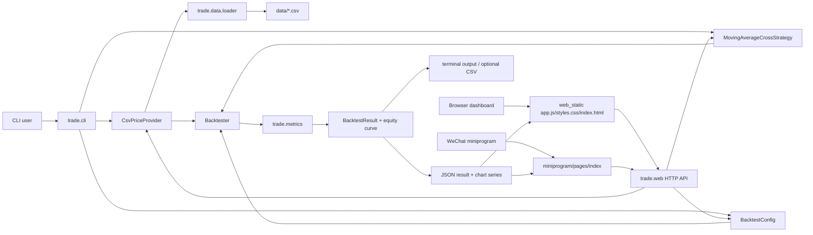
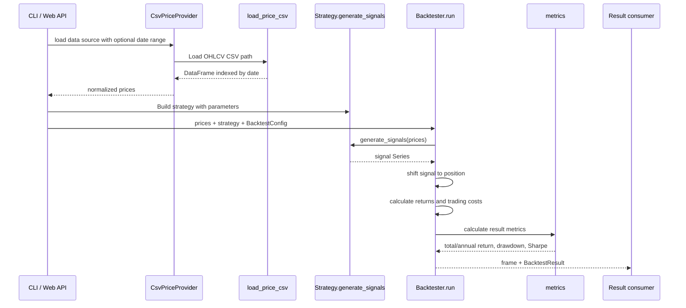
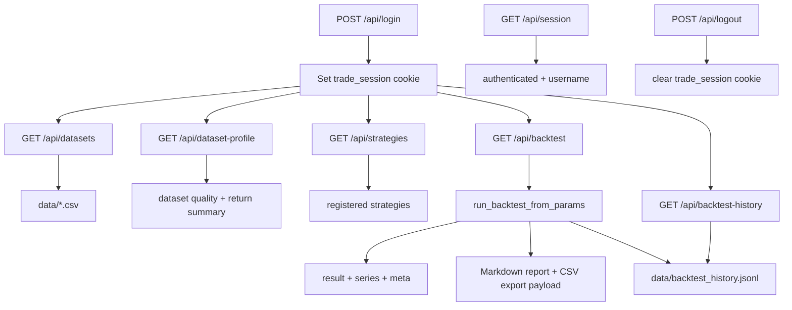
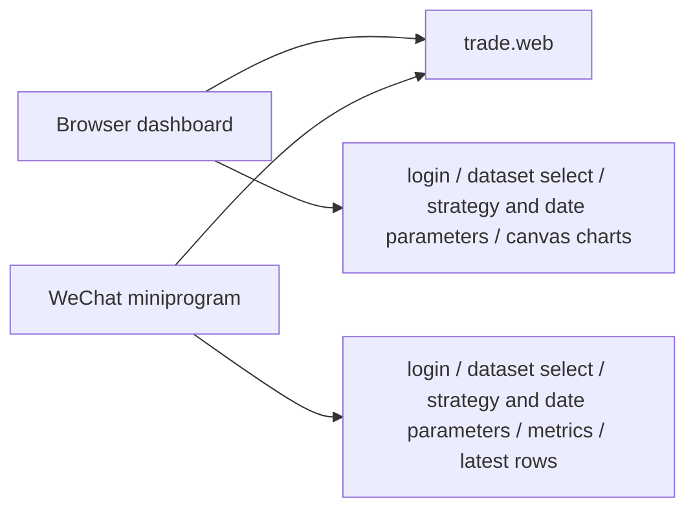
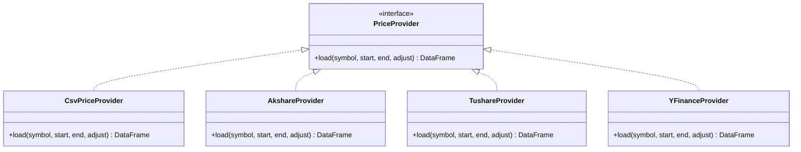

# Architecture

本文档描述当前 Trade Quant Starter 的实际架构。后续修改核心代码、接口、数据流、前端页面或小程序调用方式时，需要同步更新本文档和 README 中的相关说明。

## System Overview



当前系统是一个单标的回测与研究工作台骨架，核心由 Python 包 `trade` 承担，外部入口包括命令行、浏览器页面和微信小程序。浏览器端额外提供数据画像、参数预设、报告导出和历史记录，方便反复研究与复盘。

## Module Responsibilities

| Module | Responsibility |
| --- | --- |
| `src/trade/cli.py` | 命令行入口，解析参数，运行回测或启动本地 Web 服务。 |
| `src/trade/web.py` | 轻量 HTTP 服务，提供静态页面、登录会话、数据集列表和回测 API。 |
| `src/trade/data/loader.py` | 读取本地 CSV，校验必需列，解析日期索引和数值列。 |
| `src/trade/data/providers.py` | 数据源抽象和 CSV provider，给后续外部行情源预留统一入口。 |
| `src/trade/strategies/base.py` | 策略抽象接口，约定策略输出目标仓位信号。 |
| `src/trade/strategies/moving_average.py` | 双均线策略示例，输出 `1` 表示做多，`0` 表示空仓。 |
| `src/trade/strategies/registry.py` | 策略注册表，集中维护策略名称、展示文案和构建方法。 |
| `src/trade/backtester.py` | 回测核心，计算持仓、资产收益、成本、策略收益、权益曲线和回撤。 |
| `src/trade/metrics.py` | 指标计算，包括总收益、年化收益、最大回撤和夏普比率。 |
| `src/trade/models.py` | 不可变配置和结果数据结构，集中校验回测配置边界。 |
| `src/trade/web_static/*` | 浏览器端页面，调用 Web API，绘制净值、价格和回撤曲线，并展示数据画像、报告预览和历史记录。 |
| `miniprogram/*` | 微信小程序端，调用同一套 Web API 展示指标和最近行情。 |
| `tests/*` | 回测核心和配置边界的单元测试。 |

## Backtest Data Flow



关键约定：

- `prices` 必须非空，并包含 `close` 列。
- CSV 必须包含 `date,open,high,low,close,volume`。
- `signal` 表示目标仓位，当前支持 `1` 做多和 `0` 空仓。
- `position` 使用前一根 K 线的 `signal`，避免同一根 K 线收盘价产生信号又立即成交的前视偏差。
- `strategy_return = position * asset_return - trading_cost`。
- 成本由仓位变化乘以 `commission_rate + slippage_rate` 得到。

## HTTP API



API 返回格式：

- `result`: `BacktestResult` 的 JSON 形式。
- `series`: 用于图表或小程序列表的日期、收盘价、权益、回撤、仓位和信号。
- `meta`: 数据文件、行数、策略名称、策略参数、成本参数、运行 ID 和可选日期区间。
- `profile`: 数据行数、日期范围、缺失值、收盘价范围、买入持有收益和年化波动率。
- `report_markdown`: 用于导出的 Markdown 研究报告。
- `series_csv`: 用于导出的回测曲线 CSV。

认证机制：

- 默认账号来自 `TRADE_WEB_USER`，默认值 `admin`。
- 默认密码来自 `TRADE_WEB_PASSWORD`，默认值 `trade123`。
- session 使用 HMAC 签名 cookie，有效期 8 小时。
- 生产或共享环境必须设置 `TRADE_WEB_SECRET`，避免服务重启或默认随机密钥导致会话不可控。

## Frontend Clients



浏览器页面适合本地研究，展示曲线、数据画像、报告预览和最近回测历史。微信小程序适合在局域网或 HTTPS 域名下快速查看回测结果，目前展示指标和最近几行结果。

## Data Source Roadmap

当前实现了本地 CSV provider。后续接入外部数据源时，应继续走统一 provider 接口，避免 Web、CLI 和策略层直接依赖某个第三方库。



建议优先级：

1. `CsvPriceProvider`: 保留当前最稳定的本地数据路径，并支持基础日期过滤。
2. `AkshareProvider`: 优先覆盖 A 股、港股、基金、指数等国内研究数据。
3. `TushareProvider`: 用于更规整的 A 股行情、财务和因子数据，注意 token 和权限。
4. `YFinanceProvider`: 用于美股、ETF、海外指数的研究原型。

统一输出格式仍应保持：

```text
date index + open + high + low + close + volume
```

新增字段如 `amount, turnover, adj_factor, symbol` 可以保留，但回测核心不能强依赖这些扩展字段，除非明确升级回测模型。

## Extension Points

加新策略：

1. 继承 `Strategy`。
2. 实现 `generate_signals(prices: pd.DataFrame) -> pd.Series`。
3. 在 `strategies/registry.py` 注册 `StrategySpec`。
4. 如果策略参数不同，在 CLI/Web 参数层增加对应参数解析。
5. 增加策略参数校验和测试。

加新数据源：

1. 新增 provider 层，不直接塞进 `web.py` 或 `cli.py`。
2. 将不同数据源统一成当前 OHLCV schema。
3. 在 README 和本文档更新数据来源、配置方式和限制。
4. 对空数据、缺字段、日期乱序、非数值字段增加测试。

加新指标：

1. 在 `metrics.py` 中实现纯函数。
2. 在 `BacktestResult` 中增加字段。
3. 同步更新 Web、小程序、README 和本文档。
4. 增加边界测试，至少覆盖空值、零波动和亏损场景。

## Current Constraints

- 当前回测是单标的、单策略、单方向做多模型。
- 当前成交模型使用下一根持仓生效，但没有撮合价、涨跌停、停牌、成交量约束。
- 当前成本模型是固定比例成本，没有最低佣金、印花税、分市场费用模型。
- 当前数据层只从 CSV 读取，没有缓存、增量更新、复权处理或交易日历。
- 当前 Web 服务适合本地和开发使用，不是生产级 API 网关。
- 当前历史记录使用本地 JSONL 文件，不提供用户级隔离、清理策略或数据库查询能力。

## Documentation Maintenance Rule

每次代码更新时按下面清单检查：

- 改了模块职责：更新 “Module Responsibilities”。
- 改了回测计算顺序或字段：更新 “Backtest Data Flow”。
- 改了 API 路径、参数或返回：更新 “HTTP API”。
- 改了浏览器或小程序调用：更新 “Frontend Clients”。
- 加了数据源、策略、指标或配置项：更新 “Data Source Roadmap” 或 “Extension Points”。
- 改了安装、运行、认证或环境变量：同步更新 README。

这个规则是项目约定：后续代码变更如果影响架构、接口或使用方式，必须同时更新 `docs/architecture.md` 和 `README.md`。
